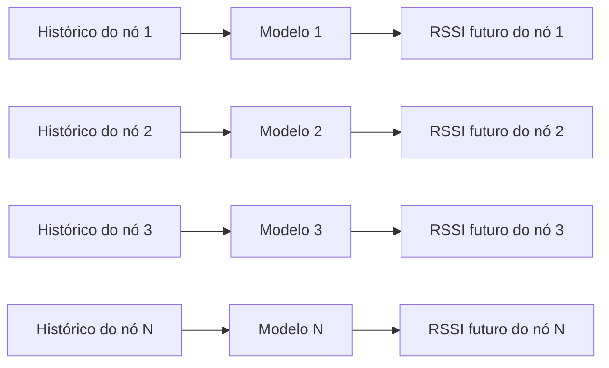
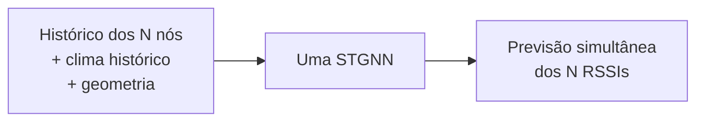
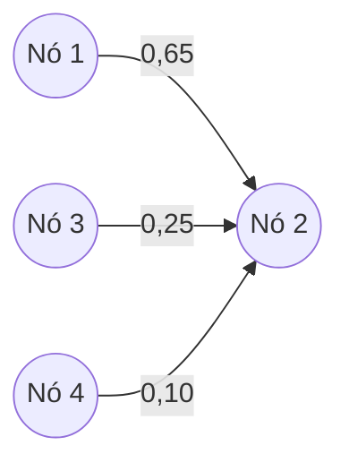
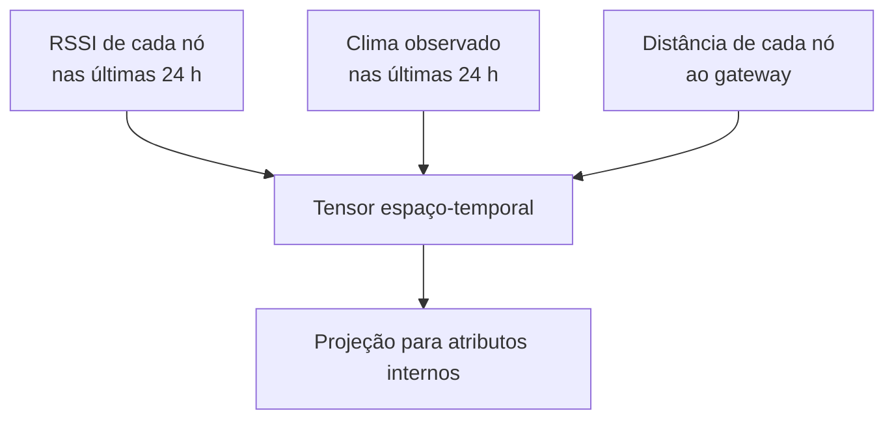
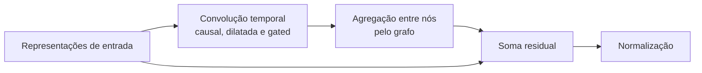
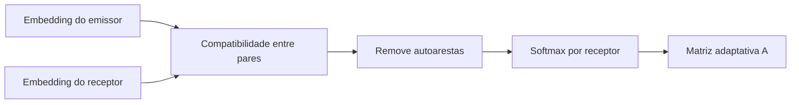
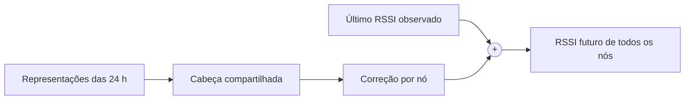

# A rede de grafos para previsão conjunta de RSSI

Este texto explica, sem pressupor conhecimento de redes neurais de grafos, o que foi
implementado neste projeto. A ideia central é simples:

> Em vez de manter um preditor isolado para cada enlace, usamos um único modelo para
> prever simultaneamente o RSSI de todos os nós e permitimos que ele aprenda quais
> históricos de outros nós ajudam cada previsão.

O modelo é uma **STGNN** (*Spatio-Temporal Graph Neural Network*): uma rede que combina
dependências **temporais** (o que ocorreu nas horas anteriores) e **espaciais** (como os
nós se relacionam).

## 1. O problema em linguagem cotidiana

Imagine nove sensores transmitindo para o mesmo gateway. A intensidade recebida de
cada sinal varia com obstáculos, ambiente, condições meteorológicas e fenômenos que
podem atingir vários enlaces ao mesmo tempo.

Um modelo dedicado trata cada nó como uma ilha:



Nossa proposta usa um único modelo integrado:



Isso reduz o número de modelos que precisam ser treinados, versionados e servidos de
**N para 1**. Mais importante: o modelo integrado pode aproveitar eventos compartilhados.
Se os sinais dos nós 2 e 7 costumam mudar juntos, essa informação pode ajudar a prever
ambos.

## 2. O que é um grafo?

Um grafo é apenas uma coleção de objetos e relações:

- cada **vértice** representa um nó LoRaWAN;
- cada **aresta dirigida** representa quanto o histórico de um nó emissor contribui
  para a representação de outro nó receptor;
- o **peso** da aresta mede a importância preditiva dessa contribuição.



Nesse exemplo didático, ao atualizar a representação do nó 2, a rede dá peso 0,65 ao
nó 1, 0,25 ao nó 3 e 0,10 ao nó 4. No código, a orientação é
`A[receptor, emissor]`, e cada linha da matriz soma 1.

Esses pesos **não** significam conexão de rádio direta, causalidade ou correlação
física. Eles significam somente: “esta combinação foi útil para minimizar o erro de
previsão nos dados de treino”.

## 3. Quais informações entram na rede?

Para cada uma das 24 horas anteriores, cada nó recebe:

1. seu RSSI;
2. temperatura, umidade, pressão e chuva históricas;
3. sua distância normalizada ao gateway.

As variáveis meteorológicas são as mesmas para todos os nós naquela hora. A distância
ao gateway é fixa por nó. Nenhum valor meteorológico futuro é consultado.



No experimento UVA, os vértices são `RSSI_01` a `RSSI_09`, correspondentes aos
sensores 01–09 recebidos pelo gateway A. O sensor 10 e os gateways B/C foram excluídos
por critérios de cobertura definidos antes da modelagem.

## 4. Como a STGNN processa essas informações?

Cada bloco espaço-temporal realiza quatro operações:



### Parte temporal

A convolução causal observa apenas o presente e o passado. Ela nunca acessa horas
posteriores à origem da previsão. As dilatações aumentam o alcance temporal dos blocos
sem exigir uma pilha muito profunda. Com dois blocos e kernel 3, as dilatações são 1 e
2, e o campo receptivo interno é de 7 passos. A cabeça final, contudo, recebe as
representações de **todas as 24 horas**, portanto o histórico completo continua
disponível para a previsão.

O mecanismo *gated* funciona como uma porta aprendida: decide quais padrões temporais
devem passar e quais devem ser atenuados.

### Parte espacial

Para cada instante, o nó receptor agrega uma média ponderada das representações dos
outros nós. Em forma simplificada:

```text
vizinhança do nó i = soma_j A[i,j] × representação do nó j

nova representação do nó i =
    transformação do próprio nó i
    + transformação de sua vizinhança
```

Não existem autoarestas no grafo: a informação do próprio nó percorre um caminho
separado. Isso impede que o peso de vizinhança seja gasto repetindo a própria série.

## 5. De onde vêm as arestas?

Implementamos quatro versões para descobrir de onde vem o ganho.

| Versão | Relação entre nós | Pergunta respondida |
|---|---|---|
| `STGNN_NoGraph` | Nenhuma aresta | A arquitetura temporal sozinha é suficiente? |
| `STGNN_PhysicalOnly` | Distância geográfica fixa | A proximidade física ajuda? |
| `STGNN_AdaptiveOnly` | Grafo aprendido dos dados | A rede descobre relações úteis? |
| `PhysicalAdaptive_STGNN` | Mistura aprendida dos dois grafos | O prior geográfico complementa o grafo aprendido? |

### Grafo físico

A distância de Haversine entre cada par de sensores é transformada por um kernel
gaussiano: sensores próximos recebem inicialmente maior peso. Depois, removem-se as
autoarestas e normaliza-se cada linha.

```text
peso físico(i,j) = exp(−distância(i,j)² / largura²)
```

Isso é apenas um prior geométrico. Ele não conhece paredes, altura, linha de visada ou
materiais dos edifícios.

### Grafo adaptativo

Cada nó possui dois pequenos vetores aprendidos: um quando atua como emissor de
informação e outro quando atua como receptor. O produto desses vetores gera um escore
para cada aresta; uma `softmax` transforma os escores em pesos positivos que somam 1.



O grafo é aprendido junto com o restante da rede, usando somente treino. Depois do
ajuste, ele é estático: não muda a cada hora.

### Grafo híbrido

O modelo híbrido aprende também quanto confiar em cada fonte:

```text
A_híbrido = α × A_adaptativo + (1 − α) × A_físico
```

O valor `α` fica entre 0 e 1 e pode ser diferente em cada bloco. Isso permite preservar
o prior espacial quando ele ajuda e privilegiar relações aprendidas quando a distância
geográfica é insuficiente.

## 6. Como nasce a previsão?

Após os blocos, as representações das 24 horas de cada nó são reunidas por uma cabeça
de previsão compartilhada. Em vez de estimar diretamente o RSSI absoluto, a rede prevê
uma correção em relação ao último RSSI observado:

```text
RSSI previsto = último RSSI observado + correção aprendida
```

Exemplo: se o último valor do nó 3 foi −102 dBm e a rede prevê uma correção de +1,5 dB,
a saída será −100,5 dBm. Essa âncora residual oferece à rede uma referência natural e
deixa para ela a tarefa de aprender a mudança esperada.



## 7. Exemplo didático completo

Suponha três sensores. Nas últimas horas, uma alteração ambiental derrubou juntos os
sinais dos nós 1 e 2, enquanto o nó 3 permaneceu estável.

1. A parte temporal reconhece a queda recente em cada histórico.
2. O grafo adaptativo pode aprender que o nó 1 é informativo para o nó 2.
3. O nó 2 combina seu próprio padrão com o padrão do nó 1.
4. A cabeça estima a correção do próximo RSSI para os três nós de uma só vez.

Um modelo isolado do nó 2 só veria a etapa 1. A STGNN pode usar também a coincidência
entre os enlaces. Esse é o mecanismo plausível por trás da hipótese, mas os pesos do
grafo não provam que a alteração ambiental foi a causa.

## 8. O que o resultado atual mostrou?

Na execução exploratória UVA `optimized_seed42` — horizonte de 1 hora, histórico de
24 horas, seed 42, otimização fresca e limite de 16 épocas — obtivemos:

| Modelo | MAE média (dB) | Interpretação |
|---|---:|---|
| `STGNN_AdaptiveOnly` | **1,8836** | Melhor resultado; venceu nos 9 nós |
| `PhysicalAdaptive_STGNN` | 1,9124 | Grafo híbrido |
| `STGNN_PhysicalOnly` | 1,9249 | Somente proximidade geográfica |
| `MultiNode_Seq2Seq` | 1,9869 | Integrado, mas sem grafo explícito |
| `STGNN_NoGraph` | 2,0341 | Controle temporal sem troca entre nós |
| `VARX` | 2,0484 | Baseline estatístico conjunto |
| `SingleNode_Seq2Seq` | 2,0491 | Nove redes dedicadas |
| `ARIMAX` | 2,1999 | Nove modelos estatísticos dedicados |

O `STGNN_AdaptiveOnly` reduziu a MAE média em aproximadamente:

- 7,4% contra a mesma STGNN sem grafo;
- 5,2% contra o Seq2Seq multinó;
- 8,1% contra nove Seq2Seq dedicados;
- 8,0% contra o VARX.

O aspecto mais interessante é a consistência: nessa execução, o grafo adaptativo venceu
em **todos os nove nós**. A ablação sem grafo indica que não foi apenas a convolução
temporal que produziu o ganho.

Ao mesmo tempo, o híbrido perdeu por 1,5% para o adaptativo. Portanto, o resultado atual
apoia a utilidade do **grafo aprendido**, mas não permite afirmar que o prior físico
melhorou a previsão nesse gateway.

## 9. O que ainda não podemos afirmar?

Essa execução é evidência promissora, não a conclusão final do artigo.

- É uma única seed e um único gateway do segundo deployment.
- As ablações reutilizam os hiperparâmetros escolhidos para o híbrido e são novamente
  treinadas; isso mantém a comparação controlada, mas não otimiza cada ablação.
- O melhor checkpoint do adaptativo ocorreu na época 16 de 16, então o teto de treino
  pode ter limitado o ajuste.
- Os ARIMAX selecionados ainda apresentam autocorrelação residual pelo Ljung–Box; sua
  especificação sazonal precisa ser fortalecida antes da comparação confirmatória.
- O grafo mostra associação preditiva, não causalidade ou conectividade de rádio.
- Prever RSSI médio horário não demonstra, por si só, ganho de ADR, energia ou PDR.

Para sustentar uma conclusão publicável, precisamos repetir o protocolo com várias
seeds, nos demais gateways elegíveis ou blocos temporais, e apresentar incerteza
pareada por origem temporal.

## 10. Resumo para apresentar em um minuto

> Construímos uma única rede espaço-temporal que prevê simultaneamente o RSSI de todos
> os nós. Ela primeiro identifica padrões nas últimas 24 horas e depois permite que cada
> nó agregue informações dos demais por meio de um grafo. Testamos grafos geográfico,
> aprendido, híbrido e ausente. No experimento exploratório UVA, o grafo aprendido foi
> o melhor em todos os nove nós, com MAE média 7,4% menor que a mesma arquitetura sem
> grafo e 8,1% menor que nove redes Seq2Seq separadas. O resultado sugere que existem
> dependências úteis entre os enlaces e que podemos consolidar N previsores em um só,
> mas ainda precisamos confirmar a estabilidade entre seeds, gateways e períodos.

## 11. Onde isso está no repositório?

- Arquitetura da STGNN: `src/models/stgnn.py`.
- Construção do grafo físico: `src/node_topology.py`.
- Registro das quatro variantes: `src/model_registry.py`.
- Treino e geração dos diagnósticos: `src/evaluation.py`.
- Gráficos e matrizes aprendidas: arquivos `*_graph_H1.png` e `*_graph_H1.json` no
  diretório de cada execução.
- Protocolo completo da execução: `benchmark_protocol_H1.json`.
- Métricas por nó: `metrics_per_node_H1.csv` e `metrics_per_node_H1.png`.

